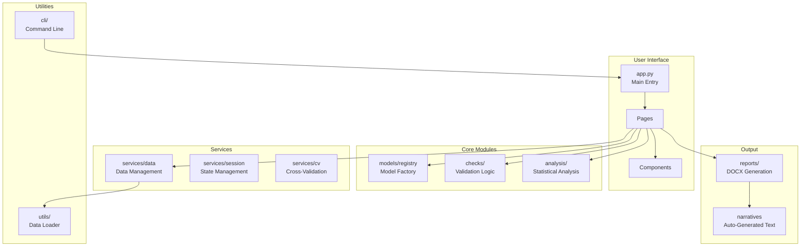

# TanML Architecture

This document provides an overview of TanML's architecture, folder structure, and component interactions.

## High-Level Architecture



## Folder Structure

```
tanml/
├── __init__.py           # Package exports & version
├── cli/                  # Command-line interface
│   └── main.py           # Entry point for `tanml` command
│
├── models/               # ML Model Management
│   └── registry.py       # Model factory, task inference, estimator builders
│
├── checks/               # Validation & Quality Checks
│   ├── meta.py           # Dataset metadata checks
│   ├── drift.py          # Feature drift detection
│   └── stability.py      # Model stability analysis
│
├── analysis/             # Statistical Analysis
│   ├── stats.py          # Statistical metrics & tests
│   ├── shap_utils.py     # SHAP explainability
│   └── cluster.py        # Cluster coverage analysis
│
├── utils/                # Utilities
│   └── data_loader.py    # Multi-format data loading (CSV, Excel, Parquet, etc.)
│
└── ui/                   # Streamlit Web Interface
    ├── app.py            # Main Streamlit app & routing
    ├── config.py         # UI configuration & styling
    ├── narratives.py     # Auto-generated insights text
    ├── glossary.py       # Term definitions
    │
    ├── assets/           # Static files (logo, images)
    │
    ├── pages/            # Page modules
    │   ├── setup.py          # Home page
    │   ├── profiling.py      # Data Profiling
    │   ├── preprocessing.py  # Data Preprocessing
    │   ├── ranking.py        # Feature Power Ranking
    │   ├── model_dev.py      # Model Development
    │   └── evaluation/       # Model Evaluation (modular tabs)
    │       ├── main.py       # Tab orchestration
    │       └── tabs/         # Extensible tab system
    │           ├── registry.py   # Tab registration
    │           ├── metrics.py    # Performance metrics
    │           ├── drift.py      # Drift analysis
    │           ├── stress.py     # Stress testing
    │           ├── explainability.py  # SHAP analysis
    │           └── benchmark.py  # Model comparison
    │
    ├── components/       # Reusable UI components
    │   └── forms.py      # Model configuration forms
    │
    ├── services/         # Business logic services
    │   ├── data.py       # Data upload & management
    │   ├── session.py    # Session state utilities
    │   └── cv.py         # Cross-validation runner
    │
    └── reports/          # Report generation
        ├── generators.py     # DOCX report builders
        └── templates/        # Report templates (if any)
```

## Data Flow

## Lifecycle Data Flow

```mermaid
flowchart LR
    A["📁 Data Ingestion"] --> B["📊 Profiling"]
    B --> C["🔧 Preprocessing"]
    C --> D["📈 Feature Tech"]
    D --> E["🤖 Model Build"]
    E --> F["🎯 Validation"]
    F --> G["📝 Audit Report"]
    
    style A fill:#e3f2fd,stroke:#1565c0
    style B fill:#e8f5e9,stroke:#2e7d32
    style C fill:#fff3e0,stroke:#e65100
    style D fill:#fce4ec,stroke:#c2185b
    style E fill:#f3e5f5,stroke:#7b1fa2
    style F fill:#e0f7fa,stroke:#0097a7
    style G fill:#fff8e1,stroke:#fbc02d
```



## Key Components

### 1. Model Registry (`models/registry.py`)
- **Purpose**: Factory pattern for ML models
- **Features**:
  - `list_models()`: Available algorithms by library
  - `build_estimator()`: Create model instances
  - `infer_task_from_target()`: Auto-detect classification/regression

### 2. Tab System (`ui/pages/evaluation/tabs/`)
- **Purpose**: Extensible evaluation tabs
- **Pattern**: Registry-based plugin architecture
- **Adding new tabs**: Create module in `tabs/`, register with `@register_tab`

### 3. Report Generators (`ui/reports/generators.py`)
- **Purpose**: Generate audit-ready DOCX reports
- **Reports**:
  - `_generate_dev_report_docx()`: Model Development report
  - `_generate_eval_report_docx()`: Model Evaluation report
  - `_generate_ranking_report_docx()`: Feature Ranking report

### 4. Services Layer (`ui/services/`)
- **data.py**: File upload handling, data persistence
- **session.py**: Streamlit session state management
- **cv.py**: Repeated cross-validation with metrics collection

## Technology Stack

| Layer | Technology |
|-------|------------|
| Web Framework | Streamlit |
| ML Libraries | scikit-learn, XGBoost, LightGBM, CatBoost |
| Explainability | SHAP |
| Data Processing | pandas, NumPy |
| Visualization | Matplotlib, Seaborn, Altair |
| Report Generation | python-docx |
| Data Formats | CSV, Excel, Parquet, Stata, SPSS, SAS |

## Entry Points

| Entry Point | Command | Description |
|-------------|---------|-------------|
| CLI | `tanml ui` | Launches the TanML UI |
| CLI with options | `tanml ui --port 8080` | Launch with custom options |
| Import | `import tanml` | Use as Python library |

## Contributing

See [CONTRIBUTING.md](CONTRIBUTING.md) for guidelines on adding new features, tabs, or models.
