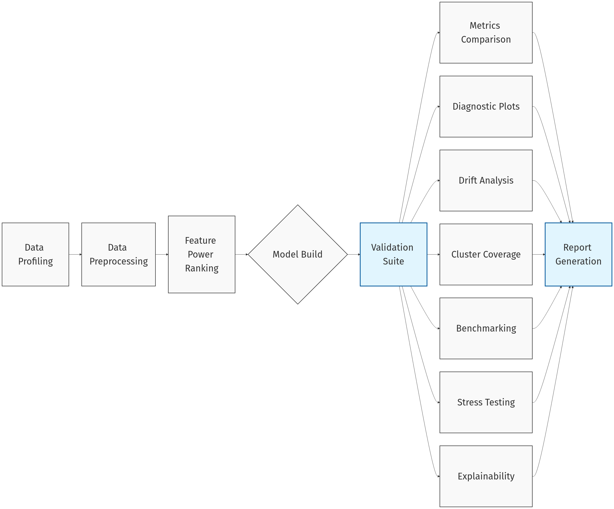

# Summary

TanML [@tanml_2026] is an open-source toolkit for validating tabular machine learning models through a user-friendly Streamlit interface. It supports an end-to-end workflow that includes data profiling, preprocessing, feature ranking, model development, evaluation, and export of editable audit-ready Word reports. The toolkit is designed to help users validate models built with common Python ML libraries such as NumPy [@harris2020array], Pandas [@reback2020pandas], scikit-learn [@pedregosa2011scikit], XGBoost [@chen2016xgboost], LightGBM [@ke2017lightgbm], and CatBoost [@prokhorenkova2018catboost]. TanML is especially useful in regulated and documentation-heavy settings (SR 11-7) because it combines model validation, explainability, drift and stress analysis, and report generation in a single local-first workflow. It is intended for data scientists, quantitative analysts, and model risk stakeholders who need a practical way to review and document tabular ML models without building custom validation pipelines from scratch.

# Statement of need

Tabular machine learning models are widely used in high-stakes domains such as finance, insurance, and other regulated settings. In these environments, building a predictive model is only one part of the workflow, because practitioners must also assess data quality, model behavior, predictive performance, robustness, and interpretability while producing documentation that supports internal review, governance, and compliance processes. In practice, these validation activities are often fragmented across notebooks, scripts, visualization libraries, and manually prepared reports, making workflows difficult to standardize, reproduce, and communicate, especially when results must be reviewed by stakeholders beyond the original model developer. TanML was developed to address this problem by providing a unified workflow for tabular model validation and documentation. Instead of requiring practitioners to assemble separate tools for analysis, evaluation, and reporting, TanML organizes these activities within a single interface intended to make validation outputs easier to reproduce, review, and communicate. The primary target audience includes data scientists, quantitative analysts, model validation teams, and other practitioners working in regulated or documentation-heavy settings who need reviewable validation artifacts in addition to numerical metrics or exploratory analysis. TanML relates to several existing categories of software, including data profiling tools, monitoring frameworks, validation libraries, and AutoML systems, but these tools typically emphasize only one portion of the workflow, such as exploratory analysis, production monitoring, programmable checks, or model training. TanML is designed to address the gap between model development utilities and governance-oriented validation workflows for tabular machine learning.

# State of the field

The open-source ecosystem already includes several widely used tools that address important parts of the tabular machine learning lifecycle. Data profiling packages such as ydata-profiling [@clemente2023ydata] emphasize exploratory analysis and dataset understanding. Monitoring frameworks such as Evidently [@evidently] focus on drift detection and production observability. Validation libraries such as Deepchecks [@deepchecks] provide programmable checks for data and model quality. AutoML frameworks such as PyCaret [@pycaret] and AutoGluon [@erickson2020autogluon] focus on model training, comparison, and selection. These tools are valuable within their intended scope, but their primary objectives differ from TanML’s integrated validation-and-documentation focus.
| Tool | Primary Focus | Scope | Output | Drift Logic |
| :--- | :--- | :--- | :--- | :--- |
| **TanML** | Model Risk Management | Data + Model + Governance | Audit-ready `.docx` | PSI and KS (SR 11-7) |
| **Evidently AI** | Monitoring | Data + Model | Dashboards | Statistical tests |
| **Deepchecks** | Testing / CI | Data + Model | Reports | Multiple methods |
| **AutoML (PyCaret / AutoGluon)** | Model Training | Model building | Models | N/A |
| **ydata-profiling** | Data EDA | Data only | HTML report | Warnings |

: Comparison of TanML with commonly used tools across primary focus, scope, outputs, and drift-analysis approach. \label{table:comparison}

Profiling tools are centered on dataset exploration rather than end-to-end model validation. Monitoring tools are designed mainly for observability and post-deployment drift analysis rather than pre-deployment validation workflows. Validation libraries provide useful checks, but they are generally oriented toward developer-driven testing rather than stakeholder-facing validation workflows. AutoML systems improve modeling efficiency, but they do not primarily address governance, documentation, or audit-ready reporting requirements.

TanML was developed to fill this gap by integrating validation-oriented tasks into a single workflow for tabular machine learning. Rather than replacing existing tools individually, it combines model evaluation, explainability, drift analysis, and stakeholder-ready reporting in one UI-driven system. This also motivates the build-versus-contribute decision. TanML’s scholarly contribution lies at the workflow level rather than in a single isolated method. The software was built as a standalone package because existing profiling, monitoring, testing, and AutoML tools do not fully address the combined need for tabular model validation and stakeholder ready documentation.

# Software design

TanML was explicitly designed as a modular, privacy-first desktop application that balances analytical rigor with non-developer accessibility. By rejecting a traditional web-based frontend (e.g., React/JS) and instead managing the entire application flow locally in pure Python via **Streamlit** [@streamlit], the toolkit lowers the barrier to entry for quantitative analysts and model risk practitioners. This trade-off allows users to inspect, extend, and deploy the UI code directly alongside their statistical models without requiring dedicated web engineering teams.

### Core Architecture

The system is built upon three primary pillars:
1. **Session State Manager:** A centralized session management system handles data flow between modules without requiring a persistent database. This architectural approach allows sensitive financial data to remain local to the user's environment, either held transiently in memory or stored in ephemeral local directories, rather than being transmitted to external hosted services.
2. **Model Registry:** A dynamic factory pattern (`tanml.models.registry`) standardizes the instantiation of various estimators (XGBoost, CatBoost, LightGBM) with pre-configured hyperparameters. This decoupling allows researchers to easily inject novel models without altering the core validation engine UI.
3. **Reporting Engine:** The `docx`-based generator serializes the analysis results into a structured Word document, mapping complex Python objects (such as **Matplotlib** [@Hunter:2007] figures and **Pandas** [@reback2020pandas] DataFrames) into native Open XML formats.

### Modular Workflow

The application is divided into distinct execution layers, designed to mirror the standard Model Risk Management lifecycle:

* **Data Profiling & Preprocessing:** Handles exploratory analysis, automated cleaning, high-cardinality encoding, and missing value imputation.
* **Feature Power Ranking:** Assesses predictive power and statistical significance (p-values) before modeling.
* **Model Development:** Facilitates champion-challenger comparisons using K-Fold Cross-Validation.
* **Evaluation (The Validation Suite):** The core engine which calculates Population Stability Index (PSI) for drift analysis, tree-based SHAP values [@lundberg2017unified] for explainability, and segmented performance metrics.

Figure 1 illustrates the modular workflow of TanML, including the main stages from data profiling and preprocessing to evaluation and reporting.

# AI usage disclosure

Portions of the `TanML` codebase, including specific unit tests and documentation templates, were refactored with the assistance of Large Language Models (LLMs). The human maintainers have reviewed and verified all AI-generated contributions to ensure technical accuracy.

# Acknowledgements

We acknowledge the valuable feedback from the pyOpenSci editor and reviewers, whose insights significantly shaped and improved the toolkit.

# References
