# Summary

TanML [@tanml_2025] is an open-source toolkit for validating tabular machine learning models through a user-friendly Streamlit interface. It supports an end-to-end workflow that includes data profiling, preprocessing, feature ranking, model development, evaluation, and export of editable audit-ready Word reports. The toolkit is designed to help users validate models built with common Python ML libraries scikit-learn [@scikit-learn], XGBoost [@xgboost], LightGBM [@lightgbm], and CatBoost [@catboost]. TanML is especially useful in regulated and documentation-heavy settings because it combines model validation, explainability, drift and stress analysis, and report generation in a single local-first workflow. It is intended for data scientists, quantitative analysts, and model risk stakeholders who need a practical way to review and document tabular ML models without building custom validation pipelines from scratch.

# Statement of need

Tabular machine learning models are widely used in high-stakes decision settings such as finance, insurance, and other regulated domains. In these environments, model development alone is insufficient, because practitioners must also evaluate data quality, feature behavior, predictive performance, robustness, and interpretability while producing documentation to support internal review, governance, and compliance processes. In practice, these activities are often fragmented across notebooks, scripts, visualization tools, and manually prepared reports, making validation workflows difficult to standardize, reproduce, and communicate. TanML was developed to address this problem by providing an integrated validation workflow for tabular machine learning models. The software brings together data profiling, preprocessing, feature ranking, model development, model evaluation, explainability, and export of editable audit-ready reports within a single interface, reducing the operational gap between model building and model validation, especially for users who need structured outputs rather than ad hoc analyses. The primary target audience for TanML includes data scientists, quantitative analysts, model validation teams, and practitioners working in regulated or documentation-heavy settings. The software is particularly useful for users who require reviewable validation artifacts, not only numerical metrics or exploratory dashboards, and its UI-driven workflow lowers the barrier for domain experts and stakeholders who may not wish to implement custom validation pipelines directly in code. TanML relates to several existing categories of software, but its focus differs from each of them: data profiling tools such as ydata-profiling support exploratory analysis of datasets, monitoring frameworks such as Evidently focus on drift and production observability, validation libraries such as Deepchecks provide programmable checks for data and models, and AutoML frameworks such as PyCaret and AutoGluon emphasize model training and selection. TanML’s contribution lies in integrating these validation-oriented needs into a unified workflow centered on tabular ML validation and stakeholder-ready documentation, making it a complementary research software package that fills the gap between model development utilities and governance-oriented validation practice.

# State of the field

The open-source ecosystem already includes several widely used tools that address important parts of the tabular machine learning lifecycle. Data profiling packages such as ydata-profiling [@ydata-profiling] emphasize exploratory analysis and dataset understanding. Monitoring frameworks such as Evidently [@evidently] focus on drift detection and production observability. Validation libraries such as Deepchecks [@deepchecks] provide programmable checks for data and model quality. AutoML frameworks such as PyCaret [@pycaret] and AutoGluon [@autogluon] focus on model training, comparison, and selection.  These tools are valuable within their intended scope, but their primary objectives differ from TanML’s integrated validation-and-documentation focus. 

| Tool | Primary Focus | Scope | Output | Drift Logic |
|---|---|---|---|---|
| **TanML** | Model Risk Management | Data + Model + Governance | Audit‑ready .docx | PSI & KS (Regulatory) |
| **Evidently AI** | Monitoring | Data + Model | Dashboards | Statistical tests |
| **Deepchecks** | Testing / CI | Data + Model | Reports | Multiple methods |
| **AutoML (PyCaret/AutoGluon)** | Model Training | Model building | Models | N/A |
| **ydata‑profiling** | Data EDA Only | Data only | HTML report | Warnings |

Profiling tools are centered on dataset exploration rather than end-to-end model validation. Monitoring tools are designed mainly for observability and post-deployment drift analysis rather than pre-deployment validation workflows. Validation libraries provide useful checks, but they are generally oriented toward developer-driven testing rather than stakeholder-facing validation workflows. AutoML systems improve modeling efficiency, but they do not primarily address governance, documentation, or audit-ready reporting requirements. 

TanML was developed to fill this gap. Its contribution is not to replace these tools individually, but to integrate multiple validation-oriented needs into a single workflow for tabular machine learning. Specifically, TanML combines data profiling, preprocessing, feature ranking, model development, model evaluation, explainability, robustness analysis, and export of editable audit-ready reports within one UI-driven system. This makes it especially relevant for regulated or documentation-heavy settings in which validation must be both analytically rigorous and reviewable by non-developer stakeholders. 

This distinction also motivates the build-versus-contribute decision. While TanML draws on capabilities adjacent to existing packages, its scholarly contribution lies at the workflow level rather than in a single isolated method. The software was built as a standalone package because the central need it addresses is the integration of tabular model validation and stakeholder-ready documentation, a combination not fully represented by existing profiling, monitoring, testing, or AutoML tools. TanML therefore complements the current ecosystem by occupying a distinct niche between model development utilities and governance-oriented validation practice.

# Software design

TanML was explicitly designed as a modular, privacy-first desktop application that balances analytical rigor with non-developer accessibility. By rejecting a traditional web-based frontend (e.g., React/JS) and instead managing the entire application flow locally in pure Python via **Streamlit** [@streamlit], the toolkit lowers the barrier to entry for quantitative analysts and model risk practitioners. This trade-off allows users to inspect, extend, and deploy the UI code directly alongside their statistical models without requiring dedicated web engineering teams.

### Core Architecture

The system is built upon three primary pillars:
1. **Session State Manager:** A centralized `SessionService` handles data flow between modules without requiring a persistent database. This architectural trade-off ensures that sensitive financial data remains transient in memory and is never written to disk unencrypted, addressing critical data privacy mandates (e.g., GDPR/CCPA, bank secrecy).
2. **Model Registry:** A dynamic factory pattern (`tanml.models.registry`) standardizes the instantiation of various estimators (XGBoost, CatBoost, LightGBM) with pre-configured, finance-optimized hyperparameters. This decoupling allows researchers to easily inject novel models without altering the core validation engine UI.
3. **Reporting Engine:** The `docx`-based generator serializes the analysis results into a structured Word document, mapping complex Python objects (such as `matplotlib` figures and `pandas` DataFrames) into native Open XML formats.

### Modular Workflow

The application is divided into distinct execution layers, designed to mirror the standard Model Risk Management lifecycle:

* **Data Profiling & Preprocessing:** Handles exploratory analysis, automated cleaning, high-cardinality encoding, and missing value imputation.
* **Feature Power Ranking:** Assesses predictive power and statistical significance (p-values) before modeling.
* **Model Development:** Facilitates champion-challenger comparisons using K-Fold Cross-Validation.
* **Evaluation (The Validation Suite):** The core engine which calculates Population Stability Index (PSI) for drift analysis, tree-based SHAP values [@shap] for explainability, and segmented performance metrics.

# AI usage disclosure

Portions of the `TanML` codebase, including specific unit tests and documentation templates, were refactored with the assistance of Large Language Models (LLMs). The human maintainers have reviewed and verified all AI-generated contributions to ensure technical accuracy and adherence to regulatory standards.

# Acknowledgements

We acknowledge the valuable feedback from the pyOpenSci editor and reviewers, whose insights significantly shaped and improved the toolkit.

# References
